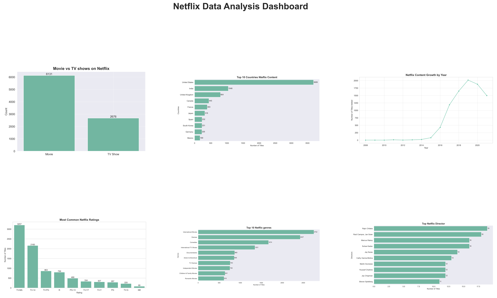

# Netflix Content Analysis
## Project Overview 
- This porject analysis Netflix Movies and Shows data using Python.
- The goal is to understand type, countries, ratings, genres, directors and content growth.

## Tools Used
- Python 
- Pandas
- Matplotlib
- Seaborn
- Jupyter Notebook

---

## 1. Movies vs TV Shows

**Analysis:**
Movies are more common than Shows on Netflix.

---

## 2. Top 10 Ckountries
 

**Analysis:**
USA has the highest number of Netflix title followed by India.

---

## 3.Content Growth by Year

**Analysis:**
Netflix content increased rapidly between 2016 and 2019.

---

## 4.Most Common Ratins

**Analysis:**
TV-MA and TV-14 are the most common ratings , showing focus on mature audiences.

---

## 5.Top 10 Genres

**Analysis:**
Drama and International Movies are the most popular genres.

---

## 6.Top Netflix Directors

**Anlysis:**
Netflic content is created by many different directors, making the catelog diverse.

---

## Final Dashboard

---

## Final Conclusion
Netflix has a large and diverse content library.
Movies dominate the platform, USA is the leading content producer and Drama is one of the most popular genres.